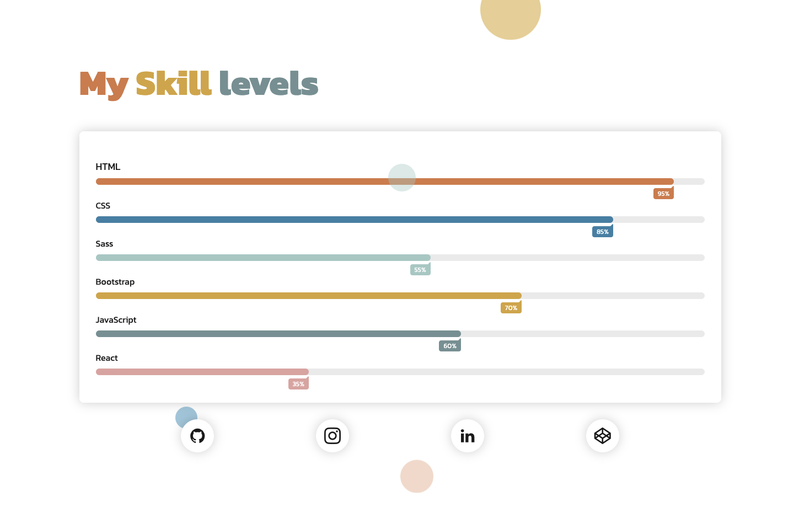

# HTML/CSS - Animating and transforming

### For this project I made a landing page showing my skill levels in front end development.  

### [Link to Live Site](https://hebaulf.github.io/html-css-animating-transforming/)   

 

I decided for this project to learn more about sass mixins, functions and using variables so it has a lot of them for the small project this is and hope I have explained them well enough to read through and understand.

 

**For my animated elements without interaction:**
- I used fade-in and slide-up motion for the content with different delays. 
- I also made a float up bubble background with 12 bubbles with various delay and duration and infinite animation iteration count. 

 

**For the animated elements with interaction:**
- I made hover transformation on the social icons where they change to the color of each media company color.
- I also made a javascript function for a bubble that follows the mouse arrow around the viewport.  

 

The page is also responsive and the heading and name for each skill has a responsive font size.
